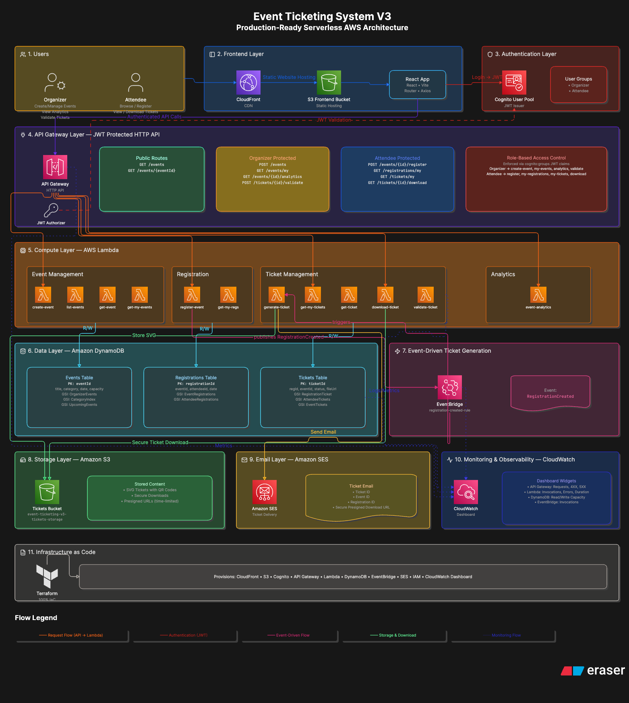

# Event Ticketing System V3

Production-ready serverless event management and ticketing platform built on AWS using React, API Gateway, Lambda, DynamoDB, EventBridge, Cognito, SES, CloudFront, S3, CloudWatch, and Terraform.

---

## Overview

Event Ticketing System V3 is a fully serverless event management platform that allows organizers to create and manage events while attendees can register, receive QR-based tickets, download tickets securely, and validate tickets during event entry.

The platform follows modern cloud-native architecture principles:

- Serverless Compute
- Event-Driven Processing
- Infrastructure as Code
- Secure Authentication & Authorization
- Scalable NoSQL Data Storage
- Cloud-Native Monitoring & Observability

---

## Live Architecture



---

## Key Features

### Organizer Features

- Create Events
- View Own Events
- View Event Analytics
- Validate Tickets
- Monitor Registrations
- View Attendance Statistics

### Attendee Features

- Browse Events
- Search & Filter Events
- Register for Events
- View Registrations
- View Tickets
- Download QR Tickets
- Receive Ticket Emails

### Platform Features

- JWT Authentication
- Role-Based Access Control
- Event-Driven Ticket Generation
- QR Code Ticket Generation
- Secure Presigned Downloads
- Email Notifications
- CloudWatch Monitoring
- Infrastructure as Code

---

# System Architecture

The application follows a layered AWS serverless architecture.

## Frontend Layer

- React
- Vite
- React Router
- Axios

Hosted using:

- Amazon S3
- Amazon CloudFront

---

## Authentication Layer

Amazon Cognito provides:

- User Registration
- User Login
- JWT Token Issuance
- User Groups

Groups:

- Organizer
- Attendee

---

## API Layer

Amazon API Gateway (HTTP API)

Protected using:

- JWT Authorizer
- Cognito Integration

Public APIs:

```http
GET /events
GET /events/{eventId}
```

Organizer APIs:

```http
POST /events
GET /events/my
GET /events/{eventId}/analytics
POST /tickets/{ticketId}/validate
```

Attendee APIs:

```http
POST /events/{eventId}/register
GET /registrations/my
GET /tickets/my
GET /tickets/{ticketId}/download
```

---

## Compute Layer

AWS Lambda Functions:

### Event Management

- create-event
- list-events
- get-event
- get-my-events

### Registration

- register-event
- get-my-registrations

### Ticket Management

- generate-ticket
- get-my-tickets
- get-ticket
- download-ticket
- validate-ticket

### Analytics

- event-analytics

---

## Database Layer

Amazon DynamoDB

### Events Table

Partition Key:

```text
eventId
```

Stores:

- Title
- Description
- Category
- Location
- Event Date
- Capacity
- Ticket Price
- Organizer ID

GSIs:

- OrganizerEvents
- CategoryIndex
- UpcomingEvents

---

### Registrations Table

Partition Key:

```text
registrationId
```

GSIs:

- EventRegistrations
- AttendeeRegistrations

---

### Tickets Table

Partition Key:

```text
ticketId
```

GSIs:

- RegistrationTicket
- AttendeeTickets
- EventTickets

---

## Event-Driven Processing

The system automatically generates tickets after registration.

Flow:

```text
Attendee Registration
        │
        ▼
register-event Lambda
        │
        ▼
RegistrationCreated Event
        │
        ▼
Amazon EventBridge
        │
        ▼
generate-ticket Lambda
        │
        ├── Generate QR Code
        ├── Store Ticket in S3
        └── Send Email via SES
```

---

## Ticket Storage

Amazon S3

Bucket:

```text
event-ticketing-v3-tickets-storage
```

Stores:

- SVG Tickets
- QR Codes

Downloads are secured using:

- Presigned URLs

---

## Email Delivery

Amazon SES

Ticket emails include:

- Ticket ID
- Event ID
- Registration ID
- Secure Download Link

---

## Security

### Authentication

Amazon Cognito JWT Tokens

### Authorization

Role-Based Access Control

Organizer Access:

- Create Events
- View Analytics
- Validate Tickets

Attendee Access:

- Register Events
- View Registrations
- View Tickets
- Download Tickets

### Additional Security

- JWT Validation at API Gateway
- Cognito Groups
- Presigned S3 URLs
- IAM Least Privilege Policies

---

# Monitoring & Observability

Amazon CloudWatch Dashboard monitors:

### API Gateway

- Request Count
- 4XX Errors
- 5XX Errors

### Lambda

- Invocations
- Errors
- Duration

### DynamoDB

- Read Capacity
- Write Capacity

### EventBridge

- Successful Invocations

---

# Infrastructure as Code

All infrastructure is provisioned using Terraform.

Provisioned Services:

- CloudFront
- S3
- Cognito
- API Gateway
- Lambda
- DynamoDB
- EventBridge
- SES
- IAM
- CloudWatch Dashboard

Infrastructure is fully reproducible using Terraform.

---

# Frontend Deployment

Build Frontend:

```bash
cd frontend

npm install

npm run build
```

Deploy Frontend:

```bash
./deploy-frontend.sh
```

CloudFront URL:

```text
https://d2xd67ws8yeqrk.cloudfront.net
```

---

# Backend Deployment

```bash
cd terraform/environments/prod

terraform init

terraform plan

terraform apply
```

---

# Project Structure

```text
Event Ticketing System V3
│
├── frontend/
│   ├── src/
│   ├── public/
│   └── package.json
│
├── lambda/
│   ├── create-event/
│   ├── list-events/
│   ├── get-event/
│   ├── register-event/
│   ├── generate-ticket/
│   ├── get-my-tickets/
│   ├── download-ticket/
│   ├── validate-ticket/
│   └── event-analytics/
│
├── terraform/
│   ├── modules/
│   │   ├── apigateway/
│   │   ├── cloudfront/
│   │   ├── cognito/
│   │   ├── dynamodb/
│   │   ├── eventbridge/
│   │   ├── iam/
│   │   ├── lambda/
│   │   ├── s3/
│   │   ├── ses/
│   │   └── cloudwatch/
│   │
│   └── environments/
│       └── prod/
│
├── docs/
│   └── architecture.png
│
├── deploy-frontend.sh
│
└── README.md
```

---

# Screenshots

Add screenshots here:

### Event Listing


### Event Details


### My Tickets


### Organizer Dashboard


### Analytics


---

# Future Improvements

- Custom Domain using Route53
- Multi-Factor Authentication
- CI/CD with GitHub Actions
- Event Check-In Mobile App
- Payment Gateway Integration
- Multi-Region Deployment
- Event Recommendation Engine

---

# Learning Outcomes

This project demonstrates hands-on experience with:

- AWS Lambda
- API Gateway
- DynamoDB
- Cognito
- EventBridge
- SES
- S3
- CloudFront
- CloudWatch
- IAM
- Terraform
- React
- Event-Driven Architecture
- Serverless Design Patterns
- Infrastructure as Code

---

## Author

Anshuman Mohapatra

Cloud / DevOps Engineer

Built as a production-style AWS serverless portfolio project.